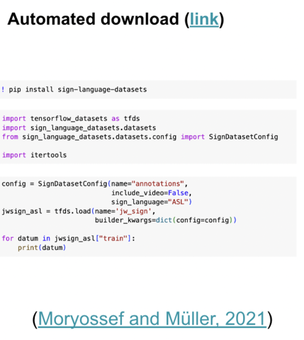

# JWSign Dataset (WIP)

Dataloader for [JWSign Dataset](https://aclanthology.org/2023.findings-emnlp.664/)


https://drive.google.com/drive/folders/1QFmq5Byg0xTLgJ7sBdVuQBlgxrkzp9vV 
Various dataset files are hosted here. 


# TODO list
We want it to look like this: 


User specifies something like "ASL", well we have only one paired spoken-language text for that, so they get ASL->en

- [ ] Allow users to specify which language-pair, perhaps via "config" as in https://tensorflow.google.cn/datasets/catalog/mlqa or https://tensorflow.google.cn/datasets/catalog/opus
- [ ] Allow users to specify include_video=False or True
- [ ] Features should be text from the verses, and video URLs, and potentially precomputed I3D
- [ ] Look the language up in ` signlanguage_spokenlanguage.json` to get "en" from "ASL"
- [ ] load in corresponding text from text51.dict.gz
- [ ] Load in splits.dict, and assign each paired datum to one of the splits accordingly. 
- [ ] if include_video, load in corresponding urls from newindex.list.gz 


# Envision loading thus: 

## Usage:

You must specify a sign language from [TODO]

## What is a Datum?

A dict with the following structure:
```
{
    "id": tfds.features.Text()
}
```

## Requirements: 
https://github.com/ShesterG/datasets/blob/shester/requirements.txt, also langcodes, language_data for testing/documenting
also sign_language_datasets
also webvtt-py for dgs corpus


## Files
### newindex.list.gz
[Link:](https://drive.google.com/file/d/1LhyPOH6JrqmSYagL4SVHLW6SjwBhsnkf/view?usp=drive_link)

A pickled Python list with URL links to the videos. 
Each list item is a dictionary. 
As far as I can tell, 

Keys: ['video_url', 'video_name', 'verse_lang', 'verse_name', 'verse_start', 'verse_end', 'duration', 'verse_unique', 'verseID']

First 10: 
```
{'video_url': 'https://download-a.akamaihd.net/files/media_publication/f3/nwt_01_Ge_ALS_03_r720P.mp4', 'video_name': 'nwt_01_Ge_ALS_03_r720P', 'verse_lang': 'ALS', 'verse_name': 'Zan. 3:15', 'verse_start': '0.000000', 'verse_end': '31.198000', 'duration': 31.198, 'verse_unique': 'ALS Zan. 3:15', 'verseID': 'v1003015'}
{'video_url': 'https://download-a.akamaihd.net/files/media_publication/59/nwt_01_Ge_ALS_39_r720P.mp4', 'video_name': 'nwt_01_Ge_ALS_39_r720P', 'verse_lang': 'ALS', 'verse_name': 'Zan. 39:2', 'verse_start': '0.000000', 'verse_end': '26.760000', 'duration': 26.76, 'verse_unique': 'ALS Zan. 39:2', 'verseID': 'v1039002'}
{'video_url': 'https://download-a.akamaihd.net/files/media_publication/59/nwt_01_Ge_ALS_39_r720P.mp4', 'video_name': 'nwt_01_Ge_ALS_39_r720P', 'verse_lang': 'ALS', 'verse_name': 'Zan. 39:3', 'verse_start': '26.760000', 'verse_end': '47.848000', 'duration': 21.087999999999997, 'verse_unique': 'ALS Zan. 39:3', 'verseID': 'v1039003'}
{'video_url': 'https://download-a.akamaihd.net/files/media_publication/10/nwt_03_Le_ALS_19_r720P.mp4', 'video_name': 'nwt_03_Le_ALS_19_r720P', 'verse_lang': 'ALS', 'verse_name': 'Lev. 19:18', 'verse_start': '0.000000', 'verse_end': '32.399000', 'duration': 32.399, 'verse_unique': 'ALS Lev. 19:18', 'verseID': 'v3019018'}
{'video_url': 'https://download-a.akamaihd.net/files/media_publication/0c/nwt_03_Le_ALS_25_r720P.mp4', 'video_name': 'nwt_03_Le_ALS_25_r720P', 'verse_lang': 'ALS', 'verse_name': 'Lev. 25:10', 'verse_start': '0.000000', 'verse_end': '8.320000', 'duration': 8.32, 'verse_unique': 'ALS Lev. 25:10', 'verseID': 'v3025010'}
{'video_url': 'https://download-a.akamaihd.net/files/media_publication/64/nwt_05_De_ALS_06_r720P.mp4', 'video_name': 'nwt_05_De_ALS_06_r720P', 'verse_lang': 'ALS', 'verse_name': 'Ligj. 6:6', 'verse_start': '0.000000', 'verse_end': '7.341000', 'duration': 7.341, 'verse_unique': 'ALS Ligj. 6:6', 'verseID': 'v5006006'}
{'video_url': 'https://download-a.akamaihd.net/files/media_publication/64/nwt_05_De_ALS_06_r720P.mp4', 'video_name': 'nwt_05_De_ALS_06_r720P', 'verse_lang': 'ALS', 'verse_name': 'Ligj. 6:7', 'verse_start': '7.341000', 'verse_end': '24.024000', 'duration': 16.683, 'verse_unique': 'ALS Ligj. 6:7', 'verseID': 'v5006007'}
{'video_url': 'https://download-a.akamaihd.net/files/media_publication/3d/nwt_05_De_ALS_10_r720P.mp4', 'video_name': 'nwt_05_De_ALS_10_r720P', 'verse_lang': 'ALS', 'verse_name': 'Ligj. 10:20', 'verse_start': '0.000000', 'verse_end': '10.644000', 'duration': 10.644, 'verse_unique': 'ALS Ligj. 10:20', 'verseID': 'v5010020'}       
{'video_url': 'https://download-a.akamaihd.net/files/media_publication/34/nwt_05_De_ALS_32_r720P.mp4', 'video_name': 'nwt_05_De_ALS_32_r720P', 'verse_lang': 'ALS', 'verse_name': 'Ligj. 32:4', 'verse_start': '0.000000', 'verse_end': '43.844000', 'duration': 43.844, 'verse_unique': 'ALS Ligj. 32:4', 'verseID': 'v5032004'}
{'video_url': 'https://download-a.akamaihd.net/files/media_publication/1e/nwt_09_1Sa_ALS_01_r720P.mp4', 'video_name': 'nwt_09_1Sa_ALS_01_r720P', 'verse_lang': 'ALS', 'verse_name': '1 Sam. 1:15', 'verse_start': '0.000000', 'verse_end': '23.557000', 'duration': 23.557, 'verse_unique': 'ALS 1 Sam. 1:15', 'verseID': 'v9001015'}
```

In the file, if we count up instances...
* There are 473428 listed verseID
* There are 31078 unique verseIDs
* There are 473428 listed verse_uniques
* There are 31078 unique verse_uniques


#### Counts and counts per split

|sign_language|english_name                 |item_count|train/dev/test  |
|-------------|-----------------------------|----------|----------------|
|ALS          | Albanian Sign Language      | 310      | 1/10/299       |
|ASL          | American Sign Language      | 29163    | 26361/1340/1449|
|LAS          | Angolan Sign Language       | 5868     | 3491/1100/1277 |
|LSA          | Argentinean Sign Language   | 17956    | 15076/1440/1440|
|ARS          | Armenian Sign Language      | 130      | 5/6/119        |
|AUS          | Australian Sign Language    | 5613     | 2913/1266/1434 |
|OGS          | Austrian Sign Language      | 252      | 1/15/236       |
|SBF          | Belgian French Sign Language| 609      | 56/67/486      |
|BVL          | Bolivian Sign Language      | 3881     | 1412/1117/1352 |
|LSB          | Brazilian Sign Language     | 30953    | 27957/1494/1498|
|BSL          | British Sign Language       | 12541    | 9557/1485/1496 |
|BLS          | Bulgarian Sign Language     | 87       | 3/2/82         |
|BRS          | Burundi Sign Language       | 3        | 0/0/3          |
|CBL          | Cambodian Sign Language     | 145      | 1/5/139        |
|CML          | Cameroon Sign Language      | 2        | 0/0/2          |
|SCH          | Chilean Sign Language       | 15357    | 12845/1282/1230|
|CSL          | Chinese Sign Language       | 4280     | 2143/778/1359  |
|LSC          | Colombian Sign Language     | 20653    | 18507/1151/987 |
|CGS          | Congolese Sign Language     | 1334     | 245/216/873    |
|SCR          | Costa Rican Sign Language   | 2099     | 478/338/1283   |
|HZJ          | Croatian Sign Language      | 960      | 85/113/762     |
|CBS          | Cuban Sign Language         | 5407     | 2869/1145/1393 |
|CSE          | Czech Sign Language         | 3412     | 1498/593/1321  |
|DSL          | Danish Sign Language        | 243      | 48/32/163      |
|NGT          | Dutch Sign Language         | 330      | 8/27/295       |
|SEC          | Ecuadorian Sign Language    | 13374    | 10608/1372/1388|
|STD          | Estonian Sign Language      | 122      | 6/9/107        |
|ESL          | Ethiopian Sign Language     | 162      | 12/18/132      |
|FJS          | Fiji Sign Language          | 30       | 0/0/30         |
|FSL          | Filipino Sign Language      | 4442     | 1942/1104/1396 |
|FID          | Finnish Sign Language       | 6327     | 3447/1396/1484 |
|VGT          | Flemish Sign Language       | 183      | 4/14/165       |
|LSF          | French Sign Language        | 7442     | 4746/1263/1426 |
|DGS          | German Sign Language        | 9346     | 6412/1432/1491 |
|GHS          | Ghanaian Sign Language      | 3186     | 1965/378/843   |
|GSL          | Greek Sign Language         | 1645     | 102/344/1199   |
|LSG          | Guatemalan Sign Language    | 2081     | 517/309/1255   |
|SHO          | Honduras Sign Language      | 2292     | 596/405/1291   |
|HSL          | Hong Kong Sign Language     | 60       | 2/1/57         |
|HDF          | Hungarian Sign Language     | 3125     | 851/837/1437   |
|INS          | Indian Sign Language        | 11385    | 8610/1358/1417 |
|INI          | Indonesian Sign Language    | 5208     | 3000/921/1280  |
|ISG          | Irish Sign Language         | 362      | 23/36/303      |
|QSL          | Israeli Sign Language       | 177      | 20/9/148       |
|ISL          | Italian Sign Language       | 20882    | 19376/796/710  |
|LSI          | Ivorian Sign Language       | 985      | 104/152/729    |
|JML          | Jamaican Sign Language      | 227      | 16/31/180      |
|JSL          | Japanese Sign Language      | 11832    | 8929/1409/1494 |
|KSI          | Kenyan Sign Language        | 3455     | 1286/929/1240  |
|KSL          | Korean Sign Language        | 18287    | 16030/1104/1153|
|LSL          | Latvian Sign Language       | 257      | 6/22/229       |
|LBS          | Lebanese Sign Language      | 28       | 0/0/28         |
|LTS          | Lithuanian Sign Language    | 170      | 5/7/158        |
|TTM          | Madagascar Sign Language    | 1935     | 321/577/1037   |
|MSL          | Malawi Sign Language        | 8861     | 6267/1246/1337 |
|BIM          | Malaysian Sign Language     | 644      | 57/84/503      |
|MTS          | Mauritian Sign Language     | 2        | 0/0/2          |
|MNS          | Melanesian Sign Language    | 117      | 9/7/101        |
|LSM          | Mexican Sign Language       | 31072    | 28057/1500/1499|
|MSR          | Mongolian Sign Language 93  | 222      | 1/17/204       |
|SLM          | Mozambican Sign Language    | 1629     | 241/311/1077   |
|BUS          | Myanmar Sign Language       | 666      | 91/99/476      |
|NSL          | Nepali Sign Language        | 228      | 5/12/211       |
|NZS          | New Zealand Sign Language   | 368      | 52/36/280      |
|LSN          | Nicaraguan Sign Language    | 2013     | 534/278/1201   |
|NNS          | Nigerian Sign Language      | 2498     | 813/617/1068   |
|NDF          | Norwegian Sign Language     | 275      | 32/29/214      |
|PSL          | Panamanian Sign Language    | 2025     | 397/326/1302   |
|LSP          | Paraguayan Sign Language    | 3810     | 1506/979/1325  |
|SPE          | Peruvian Sign Language      | 12845    | 9891/1456/1497 |
|PDF          | Polish Sign Language        | 12994    | 10085/1435/1474|
|LGP          | Portuguese Sign Language    | 2368     | 466/593/1309   |
|LSQ          | Quebec Sign Language        | 4148     | 1655/1071/1422 |
|LMG          | Romanian Sign Language      | 1656     | 126/342/1188   |
|RSL          | Russian Sign Language       | 26963    | 24109/1449/1391|
|RWS          | Rwandan Sign Language 108   | 185      | 36/33/116      |
|LSS          | Salvadoran Sign Language    | 1806     | 458/232/1116   |
|SMS          | Samoan Sign Language        | 8        | 0/0/8          |
|SBS          | Serbian Sign Language       | 328      | 62/46/220      |
|SGL          | Singapore Sign Language     | 33       | 0/0/33         |
|VSL          | Slovak Sign Language        | 2302     | 450/505/1347   |
|SZJ          | Slovenian Sign Language     | 96       | 1/2/93         |
|SAS          | South African Sign Language | 9843     | 7046/1352/1439 |
|LSE          | Spanish Sign Language       | 19403    | 16419/1485/1495|
|SLS          | Sri Lankan Sign Language    | 61       | 1/1/59         |
|SSU          | Suriname Sign Language      | 96       | 2/2/92         |
|SSL          | Swedish Sign Language       | 2540     | 768/519/1253   |
|SGS          | Swiss German Sign Language  | 270      | 12/29/229      |
|TSL          | Taiwanese Sign Language     | 2754     | 799/722/1233   |
|TZL          | Tanzanian Sign Language     | 651      | 80/104/467     |
|SIL          | Thai Sign Language          | 1456     | 143/201/1112   |
|TKL          | Turkish Sign Language       | 173      | 9/6/158        |
|USL          | Ugandan Sign Language       | 236      | 10/27/199      |
|LSU          | Uruguayan Sign Language     | 398      | 19/34/345      |
|LSV          | Venezuelan Sign Language    | 10640    | 7720/1420/1494 |
|SLV          | Vietnamese Sign Language    | 608      | 38/90/480      |
|ZAS          | Zambian Sign Language       | 4067     | 1920/886/1261  |
|ZSL          | Zimbabwe Sign Language      | 9475     | 6787/1313/1363 |


Note: There are some differences with the counts from the paper, some data items were not used in the experiments due to, e.g. issues with I3D. 


### text51.dict.gz
[Link:](https://drive.google.com/file/d/1j6_AJODqlOnC3d5SfZp_y4AhjjegwjBX/view?usp=drive_link)
text51: a pickled, compressed dict of verses in each spoken(target) language.

It is a dictionary of dictionaries. 
The structure is [language tag][verse ID]

valid language tags: ['nl', 'de', 'zh-TW', 'fr', 'en', 'es', 'pt_br', 'ms', 'sw', 'el', 'hu', 'hy', 'pt_pt', 'ro', 'mn', 'my', 'ne', 'no', 'gn', 'pl', 'sq', 'ru', 'sm', 'mg', 'bs', 'sk', 'sl', 'si', 'sv', 'th', 'tr', 'ny', 'ko', 'lt', 'bg', 'km', 'zh-CN', 'hr', 'cs', 'da', 'et', 'am', 'fi', 'id', 'it', 'ja', 'lv', 'vi', 'rw', 'ar', 'iw']

#### Table of subsets:

|Tag in text51 dict|standardized BCP-47 tag from langcodes library|Language name|verse count|
|-----|--------|-------------|-----------|
|nl |nl |Dutch  |31078|
|de |de |German |31078|
|zh-TW  |zh-TW  |Chinese (Taiwan)   |31078|
|fr |fr |French |31078|
|en |en |English|31078|
|es |es |Spanish|31078|
|pt_br  |pt-BR  |Portuguese (Brazil)|31078|
|ms |ms |Malay  |31078|
|sw |sw |Swahili|31078|
|el |el |Greek  |31078|
|hu |hu |Hungarian  |31078|
|hy |hy |Armenian   |31102|
|pt_pt  |pt-PT  |Portuguese (Portugal)  |31078|
|ro |ro |Romanian   |31078|
|mn |mn |Mongolian  |9466|
|my |my |Burmese|31078|
|ne |ne |Nepali |31078|
|no |no |Norwegian  |31078|
|gn |gn |Guarani|31078|
|pl |pl |Polish |31078|
|sq |sq |Albanian   |31078|
|ru |ru |Russian|31078|
|sm |sm |Samoan |31078|
|mg |mg |Malagasy   |31078|
|bs |bs |Bosnian|31078|
|sk |sk |Slovak |31078|
|sl |sl |Slovenian  |31078|
|si |si |Sinhala|31102|
|sv |sv |Swedish|31078|
|th |th |Thai   |31078|
|tr |tr |Turkish|31102|
|ny |ny |Nyanja |31102|
|ko |ko |Korean |31078|
|lt |lt |Lithuanian |31078|
|bg |bg |Bulgarian  |31102|
|km |km |Khmer  |31078|
|zh-CN  |zh-CN  |Chinese (China)|31078|
|hr |hr |Croatian   |31078|
|cs |cs |Czech  |31078|
|da |da |Danish |31078|
|et |et |Estonian   |31078|
|am |am |Amharic|31078|
|fi |fi |Finnish|31078|
|id |id |Indonesian |31078|
|it |it |Italian|31078|
|ja |ja |Japanese   |31078|
|lv |lv |Latvian|31078|
|vi |vi |Vietnamese |31078|
|rw |rw |Kinyarwanda|21618|
|ar |ar |Arabic |31078|
|iw |**he** |Hebrew |31078|

#### Sample items
text51["ja"]["v1001001"] gives the following string: 
``````
    1
初
はじ
めに，
神
かみ
は
天
てん
と
地
ち
を
創
そう
造
ぞう
した+。
``````


rw has 21618 items

`text51["rw"][v1001001]` gives:

```
1  Mu ntangiriro Imana yaremye ijuru n’isi.
    sign_spoken: a json file where dict[sign_language_code] = corresponding spoken language code. this is key to link newvid and text51 
```

### signlanguage_spokenlanguage.json
[link](https://drive.google.com/file/d/1KkTXQgLbXQ66gKootZXqqzCA59gFDZKD/view?usp=drive_link)
A python dictionary with sign language codes as key and spoken language codes as values. 

|Sign Language  |Spoken Language| spoken language (BCP-47 via [langcodes library](https://pypi.org/project/langcodes/))||
|-----|--------|-------------|-----------|
| ALS | sq | sq |
| ASL | en | en |
| LAS | pt_pt | pt-PT |
| LSA | es | es |
| ARS | hy | hy |
| AUS | en | en |
| OGS | de | de |
| SBF | fr | fr |
| BVL | es | es |
| LSB | pt_br | pt-BR |
| BSL | en | en |
| BLS | bg | bg |
| BRS | fr | fr |
| CBL | km | km |
| CML | fr | fr |
| SCH | es | es |
| CSL | zh-CN | zh-CN |
| LSC | es | es |
| CGS | fr | fr |
| SCR | es | es |
| HZJ | hr | hr |
| CBS | es | es |
| CSE | cs | cs |
| DSL | da | da |
| NGT | nl | nl |
| SEC | es | es |
| STD | et | et |
| ESL | am | am |
| FJS | en | en |
| FSL | en | en |
| FID | fi | fi |
| VGT | nl | nl |
| LSF | fr | fr |
| DGS | de | de |
| GHS | en | en |
| GSL | el | el |
| LSG | es | es |
| SHO | es | es |
| HSL | zh-TW | zh-TW |
| HDF | hu | hu |
| INS | en | en |
| INI | id | id |
| ISG | en | en |
| QSL | iw | he |
| ISL | it | it |
| LSI | fr | fr |
| JML | en | en |
| JSL | ja | ja |
| KSI | en | en |
| KSL | ko | ko |
| LSL | lv | lv |
| LBS | ar | ar |
| LTS | lt | lt |
| TTM | mg | mg |
| MSL | ny | ny |
| BIM | ms | ms |
| MTS | en | en |
| MNS | en | en |
| LSM | es | es |
| MSR | mn | mn |
| SLM | pt_pt | pt-PT |
| BUS | my | my |
| NSL | ne | ne |
| NZS | en | en |
| LSN | es | es |
| NNS | en | en |
| NDF | no | no |
| PSL | es | es |
| LSP | gn | gn |
| SPE | es | es |
| PDF | pl | pl |
| LGP | pt_pt | pt-PT |
| LSQ | fr | fr |
| LMG | ro | ro |
| RSL | ru | ru |
| RWS | rw | rw |
| LSS | es | es |
| SMS | sm | sm |
| SBS | bs | bs |
| SGL | en | en |
| VSL | sk | sk |
| SZJ | sl | sl |
| SAS | en | en |
| LSE | es | es |
| SLS | si | si |
| SSU | nl | nl |
| SSL | sv | sv |
| SGS | de | de |
| TSL | zh-TW | zh-TW |
| TZL | sw | sw |
| SIL | th | th |
| TKL | tr | tr |
| USL | en | en |
| LSU | es | es |
| LSV | es | es |
| SLV | vi | vi |
| ZAS | en | en |
| ZSL | en | en |


There are 98 sign languages in the dictionary, and there are 51 spoken languages in the dictionary. 


# JW Sign Create Index

[TODO] The process for recreating the index. 

Essentially you do 

```
pip install -r create_index_requirements.txt
python create_index.py
```

Note: requires ffmpeg to be installed on the command line so Python can run it via subprocess call. 